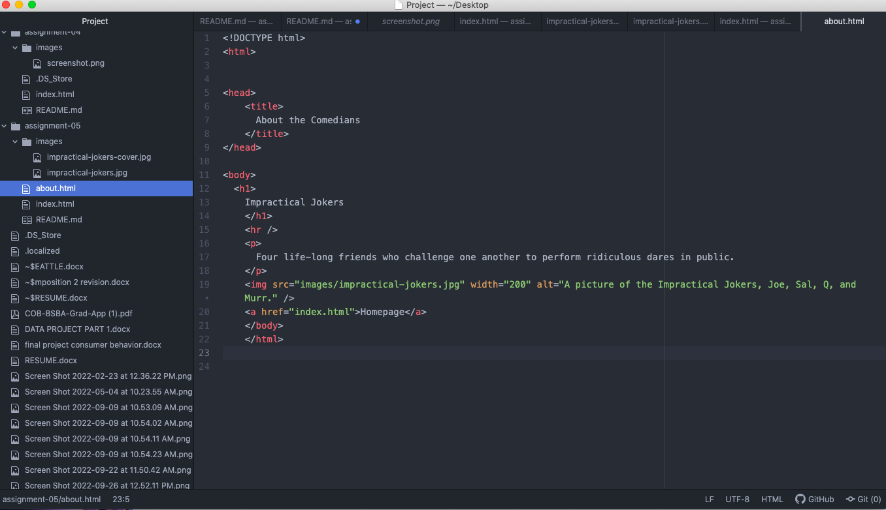

I visited the Hersheyland website from 1996. It is evident that the website is outdated because of the colors on the site, the shape of the buttons, the font of the text, and how small the webpage is on the screen.

The older version of the site uses blue and gold as the color scheme. The buttons are pretty small, includes one picture on the homescreen of the hershey's cocoa product, and everything fits on one page, without having to scroll down. Today, the website includes many pictures, of not just the product, but of people enjoying the product as well. They use lots of colors, not just blue and gold, but right now the site is halloween themed. The website also includes links to all of their products and even includes recipe ideas. Finally, the website requires scrolling up and down to see all of the content on the screen. 
