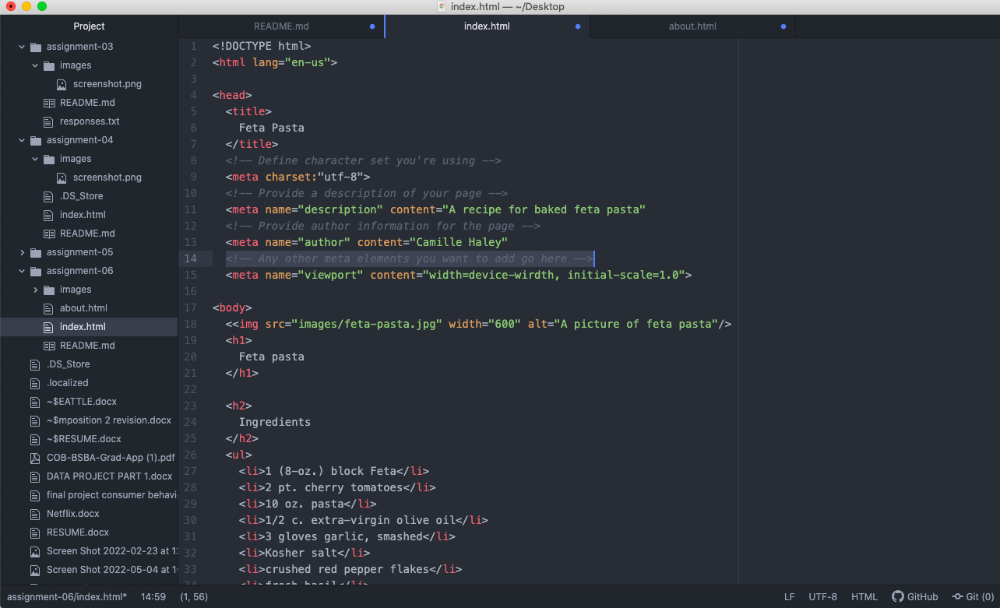
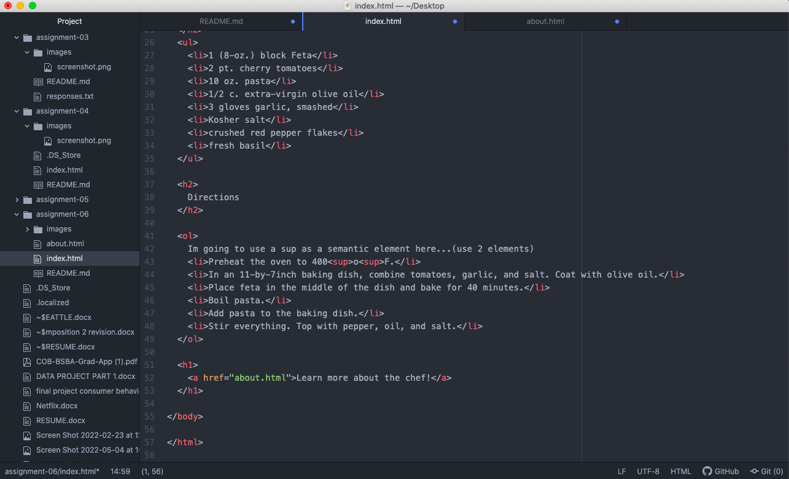

Structural markup refers to the styling of the page and contains elements that structures) the page layout. It includes titles, headings, and paragraphs.
Semantic markup goes that extra step and provides additional information, on the data, like word emphasis, quotation marks, and meaning of acronyms.

