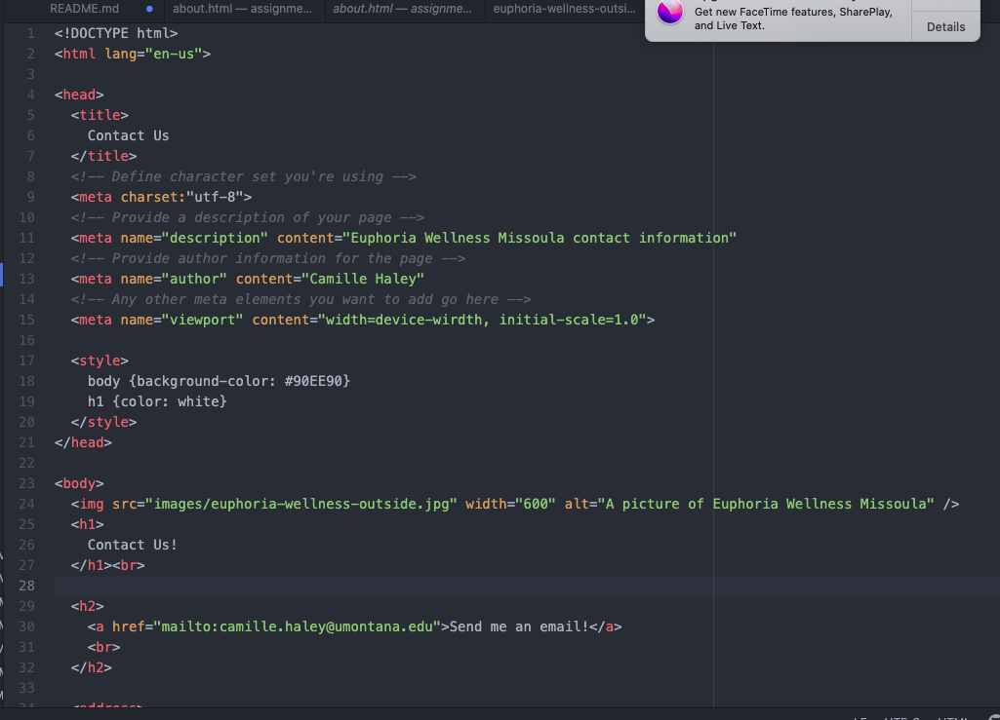

Many of the forms I have come across are contact forms which allow a visitor to send a message to the website owner. I prefer contact forms because they are a lot less pressure than directly emailing someone to contact them and it is super easy! It also shows that the owner is interested in their potential clients/customers.

