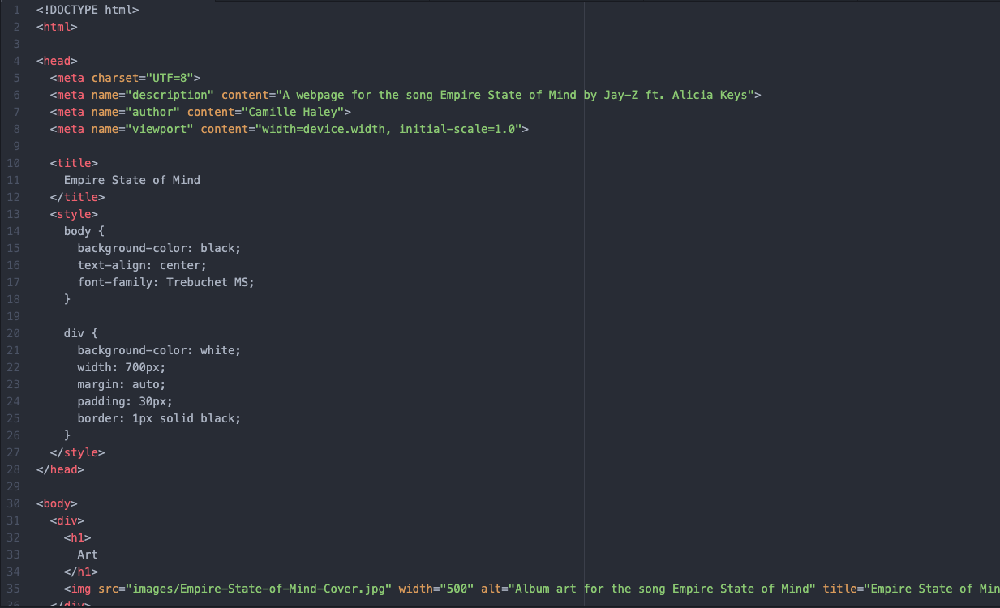

Affordances are sets of possible actions for an object. It gives a clear understanding of how it can be used or how it should be used.

Using a third party service to host videos is easy and allows you to upload the video directly, it compresses the size of the file for you, and allows you to communicate quicker, like through comments. However, using a third party means that you do not own that content and you cannot customize it to your liking, you are stuck with the original content.

