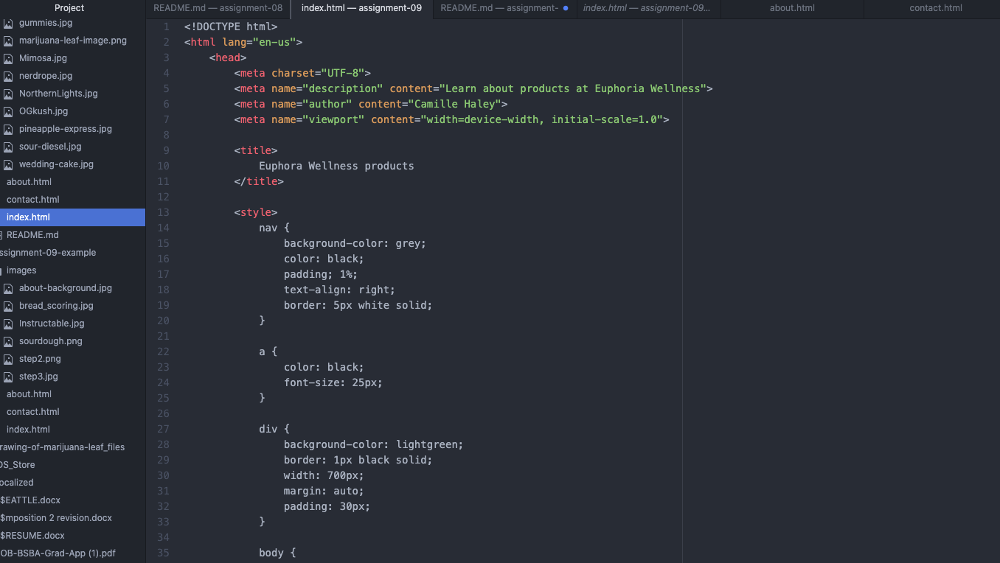

Everything about HTML is new to me. When i started this class I knew nothing about coding. I think that learning HTML is very interesting and it is something that I never thought I would like. People do not realize how much information and symbols and letters go into building HTML and I think the most difficult part is understanding and remembering all of the different elements.

I am excited to just learn more about how to decorate HTML but anxious because it is a lot to remember.

