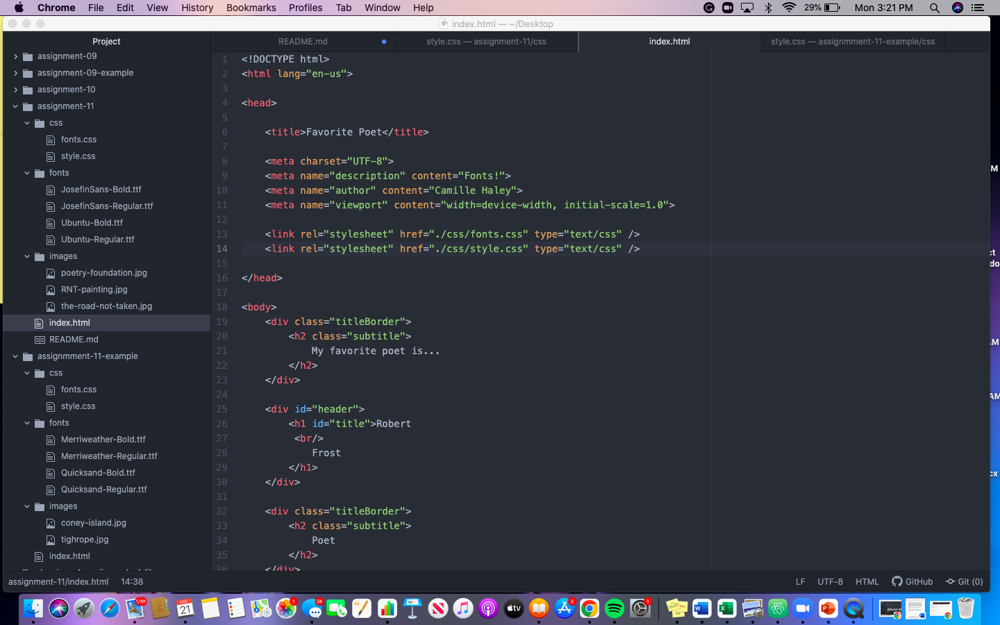

Typography is the art and technique of arranging type to make written language legible, readable, and appealing on display. It is about organizing textual information and how we can present it optimally to our users.

Fallback fonts or font stacks are used when the primary font choice fails to load. You should not choose fallback fonts carelessly because there are instances when primary fonts load slowly and then next font in the stack takes it place while it processes.

A system font, also known as a web safe font, is one that is already assumed to be on the vast majority of users' devices. Web font is any font used in website's design that isn't installed by default on the end user's device. 

